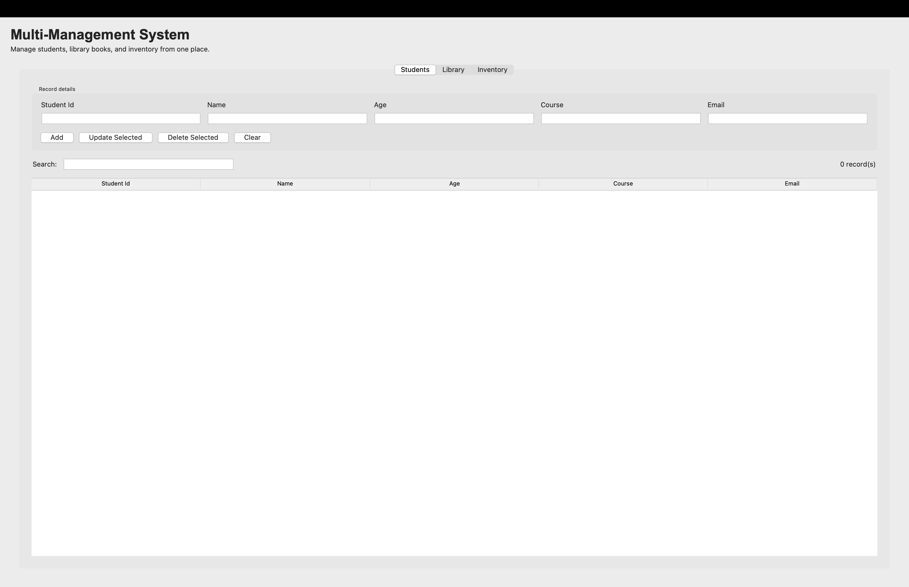

# Multi-Management System

A beginner-friendly Python mini project that combines three useful management systems in one application:

- Student Management
- Library Management
- Inventory Management

The project can be used in two ways: through a menu-driven console program or through a simple Tkinter desktop interface. Both interfaces use the same saved data.

## Application screenshot



## Features

### Student Management

- Add student ID, name, age, course, and email
- View every saved student
- Search students by any detail
- Update or delete selected student records
- Validates email addresses, ages, and duplicate student IDs

### Library Management

- Add book ID, title, author, and available quantity
- Search, update, and delete book records
- Prevents duplicate book IDs

### Inventory Management

- Add item ID, item name, category, quantity, and price
- Search, update, and delete inventory records
- Validates that quantities and prices are valid positive numbers

### General features

- Records are saved automatically as JSON files in the `data` folder
- Data is retained when the program is closed and opened again
- No external Python packages are needed
- Clear validation messages help avoid incorrect data entry

## Requirements

- Python 3.10 or later
- Tkinter (included with standard Python installations)

## How to run the project

Open a terminal in this project folder and choose one option below.

### Run the console application

```bash
python3 main.py
```

You will see a main menu where you can select Student, Library, or Inventory Management.

### Run the desktop UI

```bash
python3 gui.py
```

The desktop application opens with three tabs: **Students**, **Library**, and **Inventory**. Choose a tab, fill in the fields, and use the buttons to add, update, delete, or search records.

## Project structure

```text
Python assignment/
├── main.py                     # Console application entry point
├── gui.py                      # Tkinter desktop application entry point
├── student_manager.py          # Data storage, validation, and CRUD logic
├── README.md                   # Project documentation
├── .gitignore                  # Files excluded from GitHub
├── application-screenshot.png
└── data/                       # Created automatically for saved JSON data
```

## Saved data

The application automatically creates these files after you add records:

```text
data/students.json
data/books.json
data/items.json
```

These files hold local data and are excluded from GitHub by `.gitignore`, so personal or test records are not uploaded.


# *Created as a Python mini assignment project.
